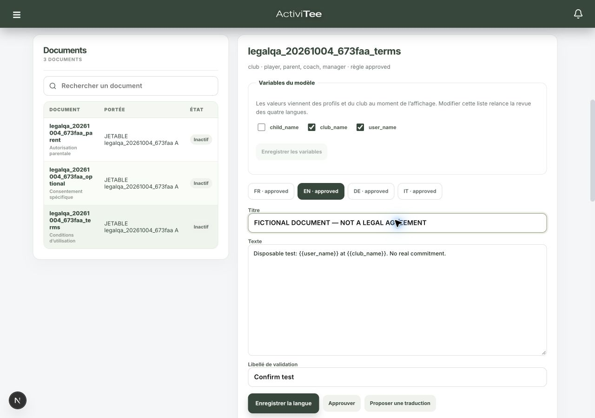

# Rapport unique — campagne de validation des documents juridiques

Date : 4 octobre 2026. Dépôt : `/Users/activitee/Projects/nextee`, branche locale `test`.

## Conclusion

**Le module n’est pas prêt à être activé.** La campagne a démontré des parcours métier fonctionnels, corrigé des défauts applicatifs et préparé un seul lot SQL. Elle a aussi confirmé des défauts encore présents sur TEST, puisque ce lot n’a pas été appliqué durablement.

- **56 tests locaux réussis**, TypeScript et lint ciblé sans erreur.
- **42 vérifications SQL réussies avec le lot candidat**, dans une transaction intégralement annulée : versions, décisions, refus/retrait, représentation parentale, code, idempotence, séparation des clubs et régression des appels internes.
- **94 accès PostgREST refusés** : 47 relations privées, deux identités (`anon` et Player), requêtes `limit=0` sans lecture de données personnelles.
- Chrome : **20 états enregistrés** sur les cinq rôles, en 1280 × 900 et 393 × 852, plus captures de l’éditeur Admin avec un document fictif sélectionné. Cela valide les écrans chargés et leur disposition ; cela ne valide pas une décision juridique dans Chrome avec une version active.
- La publication HTTP échoue sur le TEST actuel. Le parcours complet publication → présentation → décision dans Chrome reste **non vérifié**, même si son noyau SQL passe dans la transaction de validation.

Aucune conclusion sur la production, aucune attestation de conformité juridique et aucune activation ne découlent de ces résultats.

## 1. Environnement et limites respectées

Le projet a été identifié dans Chrome et recoupé avec la configuration locale : **golf-juniors-app**, branche **test / PREVIEW**, référence **`wizbeuuvjibmmuxyynly`**, URL Supabase `https://wizbeuuvjibmmuxyynly.supabase.co`. Les API applicatives ont été exercées sur `http://127.0.0.1:3000`, qui utilise ce projet TEST. Ce nom d’hôte permettait une session Chrome fictive distincte de la session réelle sur `localhost`.

Les migrations `20261020` à `20261101` n’ont pas été rejouées. Les README, readiness, matrice, audit 21, postflight 22, migrations et routes juridiques ont été lus ; les définitions courantes de la base ont été exportées avant les corrections.

`legal_enforcement_control.enabled` est resté **false**, y compris dans la transaction de validation. `LEGAL_ENFORCEMENT_ENABLED` et l’envoi parental sont restés désactivés. Seuls les trois documents fictifs du club fictif A ont été rendus actifs **à l’intérieur de la transaction annulée** pour exercer les décisions SQL. Aucun document n’a été laissé actif, aucune version publiée ni décision conservée.

Les tests locaux du calcul des exigences utilisent des objets simulés avec un garde actif : ce ne sont pas des changements de configuration de TEST. Les comportements du garde actif dans la base réelle ne sont pas revendiqués.

Preuves : [inventaire courant](evidence/20261004-test-inventory.json), [préflight final, 26 lignes](evidence/20261004-fix-preflight.json), [état après annulation](evidence/20261004-direct-read-results.json), [état final et nettoyage](evidence/20261004-cleanup.json).

## 2. Défauts démontrés et corrections

| Défaut | Démonstration | Correction et état |
|---|---|---|
| Enregistrement/revue de traduction renvoyant 503 | Le filtre JSON PostgREST recevait `[object Object]`, erreur `22P02` | Sérialisation JSON explicite dans les routes Admin et traduction ; sauvegarde et approbation persistées sur TEST, quatre tests de route avec le véritable constructeur de requêtes Supabase |
| Approbation possible sans garantir le texte effectivement relu | Le bouton restait utilisable après une édition locale non enregistrée ; le serveur approuvait le texte courant sans comparer le texte relu | Bouton désactivé tant que le texte n’est pas sauvegardé ; `expected_translation` et révision exigés côté serveur ; texte périmé et ancien client refusés avec 409 |
| Document non applicable d’un autre club susceptible de bloquer l’utilisateur | Deux tests reproduisaient un échec sur une règle non supportée ou une version absente appartenant à un autre club | Filtrer les documents par rôle/club avant de valider leurs règles et versions ; les erreurs d’un document applicable continuent de bloquer explicitement |
| Publication des trois documents fictifs impossible | HTTP 409 : `function digest(text, unknown) does not exist` | Lot SQL : `extensions.digest` dans quatre fonctions. Publications réussies dans la transaction annulée ; **défaut encore présent sur TEST hors transaction** |
| RPC internes accessibles à des clients non autorisés | Un autre club modifie le titre du fil A ; `anon` recalcule le score d’une partie A et lit l’UUID du coach ; les deux synchronisations acceptent aussi des appels non autorisés | Lot SQL : retrait d’EXECUTE à `public`, `anon`, `authenticated` pour cinq helpers ; service conservé. Refus attendus et déclencheurs métier vérifiés dans la transaction annulée |
| Marketplace lisible depuis un autre club et anonymement | Chaque identité récupère la même annonce fictive A malgré la portée club de l’API | Lot SQL : politique restrictive de frontière de club, combinée aux règles de propriétaire/parent déjà présentes. Propre club accepté, autre club et anonyme filtrés dans la transaction annulée |
| Édition d’événement avec un ancien snapshot aboutissant à un timeout | Édition normale persistée et relue dans Chrome ; deuxième requête périmée : `upstream request timeout` | Lot SQL : les conflits applicatifs des cinq fonctions concernées passent de `40001` à `PT409`. Le test d’occurrence Manager renvoie alors exactement `PT409 / planning_conflict`. Gestion des codes actuel et ancien dans les routes parents/stages |

Le diagnostic du timeout s’appuie sur le corps SQL observé, le comportement HTTP et le problème documenté de tentatives automatiques dans PostgREST 14, version 14.5 observée sur TEST. La correction réserve le code de sérialisation aux véritables conflits transactionnels et conserve le message métier. [Explication officielle Supabase](https://supabase.com/docs/guides/troubleshooting/high-cpu-and-infinite-transaction-retries-when-using-custom-error-codes-in-rpc-functions-77326b).

Pour les RPC `sync_event_thread_participants` et `sync_org_player_performance_from_groups`, l’acceptation de l’appel non autorisé est démontrée. Aucune incohérence supplémentaire n’a été injectée pour forcer une modification effective : le rapport ne leur attribue donc pas une mutation constatée.

Preuves : [HTTP juridique](evidence/20261004-http-results.json), [métier et accès](evidence/20261004-business-results.json), [revue, traduction et documents](evidence/20261004-extra-results.json), [helper d’acteur](evidence/20261004-actor-helper.json), [édition et timeout](evidence/20261004-event-edit.json), [lot candidat](evidence/20261004-candidate-rollback-results.json).

## 3. Matrice des scénarios réellement exécutés

**RÉUSSI TEST** signifie une réponse HTTP/UI et, pour les mutations, une relecture persistée. **RÉUSSI SQL ANNULÉ** signifie une vérification dans PostgreSQL avec le candidat, avant `ROLLBACK` ; ce n’est ni une écriture conservée ni une preuve du parcours navigateur complet.

| Scénario | Résultat | Preuve / limite |
|---|---|---|
| Création de trois brouillons, quatre langues FR/EN/DE/IT, revue des textes et règle | RÉUSSI TEST après correction | `http-results` : documents terms, optional, parent ; textes explicitement fictifs |
| Proposition de traduction automatique | RÉUSSI TEST | `extra-results` : statut `proposed`, variables préservées ; approbation distincte ; aucune qualité juridique des traductions attestée |
| Sauvegarde/revue depuis l’éditeur Admin mobile | RÉUSSI TEST | `extra-results` : texte modifié et approbateur relus en base ; captures Admin |
| Texte relu périmé / aperçu de publication périmé | RÉUSSI TEST | HTTP 409 ; aucune publication ; trois aperçus périmés refusés |
| Publication HTTP avec quatre langues revues | ÉCHOUÉ TEST | Trois erreurs de résolution `digest` |
| Publication avec correction SQL | RÉUSSI SQL ANNULÉ | Trois versions fictives créées, puis annulées |
| Présentation et décision Player FR, Parent EN, Coach DE, Manager IT | RÉUSSI SQL ANNULÉ | Identité, langue, snapshot sans variable restante et idempotence vérifiés |
| Décision d’un Admin sur un document lui étant applicable | NON VÉRIFIÉ | Écran `/legal/my` Admin chargé sans document actif ; aucune décision Admin exécutée |
| Nouvelle version, historique V1, refus de décider sur présentation V1 après V2 | RÉUSSI SQL ANNULÉ | Ancien état conservé, nouvelle présentation exigée, décision refusée sur ancien texte |
| Refus, retrait facultatif, conflit avant nouvelle autorisation, résolution motivée | RÉUSSI SQL ANNULÉ | État courant et journal du retrait conservés avant rollback |
| Représentation parentale | RÉUSSI SQL ANNULÉ | Lien familial seul insuffisant ; assertion vérifiée nécessaire ; révocation bloque la présentation |
| Confirmation parentale par code | RÉUSSI SQL ANNULÉ | Mauvais code incrémente la tentative ; bon code consigne bénéficiaire/autorité ; code consommé non réutilisable ; limitation de fréquence |
| Réessai et double décision avec même clé | RÉUSSI SQL ANNULÉ | Même identifiant ; changement de décision avec même clé refusé ; réessai parental fonctionne après consommation du code |
| Ancien client sans snapshot de revue/publication | RÉUSSI LOCAL / SQL ANNULÉ | Approbation refusée dans les tests de route ; publication sans aperçu refusée en SQL |
| Deux clubs / faux rôle / langue inconnue | RÉUSSI SQL ANNULÉ | Présentations étrangères, faux rôle Manager et langue `es` refusés |
| Accès Admin par anon, Player, Parent, Coach, Manager, second club | RÉUSSI TEST | Six refus HTTP 403 |
| Lecture des preuves et RPC réservés au service par clients | RÉUSSI TEST | `42501` ; 94 lectures `limit=0` refusées sur les 47 relations privées |
| Groupe, création d’événement et réessai de création | RÉUSSI TEST | IDs persistés ; fil créé indirectement ; même événement au réessai initial ; lecture étrangère vide |
| Édition occurrence Manager et chaîne Manager → Coach | PARTIEL | Édition normale persistée ; conflit HTTP échoué ; correction et conflit `PT409` vérifiés en SQL annulé |
| Messagerie | RÉUSSI TEST, cas limité | Message entre comptes fictifs persisté ; lecteur du second club refusé |
| Golf / OM | RÉUSSI TEST, cas limité | Partie + trou, agrégat, édition parentale ; autre joueur refusé ; lecture OM Manager autorisée et étrangère refusée |
| Marketplace | ÉCHOUÉ TEST / CORRIGÉ SQL ANNULÉ | Lecture interclub/anonyme confirmée ; frontière corrigée seulement dans le candidat |
| Documents privés | RÉUSSI TEST, cas limité | Préparation → dépôt signé → finalisation → ligne persistée ; accès Player/Parent ; autre club 403 ; dépôt direct refusé ; téléchargement privé étranger refusé |
| Demande relative aux données | RÉUSSI TEST, circuit de revue | Demande fictive persistée, passage en vérification puis clôture ; aucune exécution réelle d’un droit d’accès/effacement |
| Immutabilité des décisions et présentations | RÉUSSI SQL ANNULÉ | Modification/suppression rejetée même pendant le test privilégié |
| Garde actif, blocage après refus et retrait dans les fonctions métier | NON EXÉCUTÉ | Les deux mécanismes d’activation sont restés désactivés, conformément au garde-fou |

Comptes des fichiers d’exécution : HTTP juridique **22 réussis / 3 échoués**, métier **10 / 5**, complément **8 / 0**, lot SQL annulé **42 / 0**, lectures privées **94 / 0**. Le helper d’acteur et le timeout d’édition ont chacun une preuve d’échec séparée. Ces nombres portent sur des assertions différentes et ne constituent pas un taux global de conformité.

### Chrome et Admin

Les parcours d’accueil Player, Parent (via l’espace Player), Coach, Manager et `/legal/my` pour les cinq rôles ont été chargés avec les comptes fictifs. Le détail de l’événement Manager modifié a été rouvert. Les 20 états enregistrés ne présentent pas de débordement horizontal aux deux largeurs contrôlées. [États DOM, URL et dimensions](evidence/20261004-browser-results.json).

`/admin/legal` a été contrôlé avec un vrai brouillon fictif sélectionné : liste, onglets de langues, champs titre/texte/action, sauvegarde, approbation et zone de comparaison. La charte Admin existante est conservée. La grille de comparaison respecte désormais la largeur disponible sur petit écran.



[Éditeur mobile](evidence/admin-editor-mobile.png) · [Comparaison mobile](evidence/admin-review-mobile.png)

La publication, les écrans de décision et l’historique non vide dans Chrome restent bloqués par le défaut SQL de publication actuel. Pas de validation native iOS, de lecteur d’écran ou d’usage hors ligne dans cette campagne.

## 4. Audit des accès directs et indirects

Le [registre de revue](evidence/20261004-access-review.csv) comporte **367 entrées** : 223 fonctions, 138 relations et six buckets. Chaque entrée conserve finalité, rôles/grants, colonnes ou paramètres de portée, qualification, appels indirects repérés et limite de preuve. L’[export SQL](evidence/20261004-test-inventory.json) contient les corps complets, politiques, contraintes et triggers, plus une ligne d’environnement.

La classification du registre sert au triage. Une signature, un grant ou l’absence du mot `legal_required_` n’est pas une faille confirmée. Les conclusions confirmées reposent sur les fixtures et sur les chaînes d’appel inspectées ; les autres restent des points de revue.

| Surface | Qualification actuelle | Travail restant |
|---|---|---|
| 91 fonctions réservées au service/interne | Accès client direct fermé par privilèges | Autorisations des routes et des fonctions privilégiées appelantes à maintenir |
| 39 fonctions avec garde ou prédicats du garde | Garde présent, inactif | Tester son effet métier après une future autorisation d’activation sur environnement jetable |
| 39 fonctions de trigger | Pas de mutation RPC autonome du seul fait d’EXECUTE | Inspecter le droit sur l’écriture déclenchante ; ne pas couper les dépendances internes |
| 41 prédicats d’autorisation booléens | Pas de contournement métier démontré | Certains prennent un UUID arbitraire : revoir finalité, exposition anonyme et divulgation d’appartenance/rôle |
| 7 fonctions de calcul/contexte JWT | Pas de mutation métier persistée | Exemption justifiable, à formaliser |
| 5 helpers internes exposés | Appels non autorisés confirmés | Appliquer le candidat puis refaire les refus HTTP et leurs parcours autorisés |
| `staff_seed_group_players_attendees` | Mutation avec contrôles de rôle existants ; absence de frontière juridique propre | Revoir garde de l’événement et activité des membres/coach ; aucune preuve de contournement d’un garde actif n’est revendiquée |
| 47 relations privées | Privilèges fermés et 94 refus HTTP vérifiés | Les traitements serveur restent une surface distincte |
| 11 relations avec RLS sans politique permissive | Lignes directes fermées structurellement | Ne pas interpréter le grant SELECT seul comme accès effectif |
| 12 relations d’identité/initialisation | Profil, clubs, rôles, familles, préférences et contexte nécessaires avant accord | Définir des exemptions minimales ; éviter de bloquer connexion, choix d’enfant et consultation juridique |
| `app_translations` | Catalogue public en lecture, finalité distincte | Conserver sa lecture publique ; toute écriture cliente doit rester interdite |
| 8 relations avec garde restrictif, plus Marketplace | Couche installée, inactive | Formaliser la portée juridique propre à chaque club/bénéficiaire ; appliquer la frontière Marketplace du candidat |
| 58 autres relations métier avec RLS | Couverture juridique non démontrée | Revue des politiques et des parents appelés ; **ce nombre ne signifie pas 58 failles** |
| 5 buckets publics | URLs publiques intentionnellement servies hors garde d’acceptation | Décider les contenus admissibles, révocation, suppression et caches |
| `player-documents` privé | Parcours signé et refus directs contrôlés | Retrait d’accès après émission d’une URL, expiration, caches et traitements différés à compléter |

### Chaînes et limites significatives

- `create_manager_events_v1` déclenche la création/synchronisation du fil ; la révocation des cinq helpers préserve le propriétaire privilégié des triggers. La mise à jour de l’événement et le recalcul du trou réussissent dans le candidat.
- `create_manager_activity_batch_v1` consulte le garde plateforme, puis la création repasse par le groupe et son garde, y compris lorsqu’un groupe technique est créé. L’absence de garde club en première ligne n’est donc pas une preuve de contournement. Le chemin de réessai retournant un résultat antérieur mérite une revue du besoin de validation club.
- Les politiques de certaines tables enfants passent par une table parente déjà filtrée ; d’autres utilisent des helpers `SECURITY DEFINER` qui peuvent contourner la RLS parente. Les dépendances de la colonne `indirect_calls` doivent être suivies avant une extension de politique.
- Golf : plusieurs entrées et politiques ne demandent que les validations plateforme, tandis qu’un appel de trou peut déterminer un club via l’organisation OM. La portée attendue doit être définie puis harmonisée ; elle n’est pas réputée complète.
- Le garde HTTP protège les familles de pages Player/Coach/Manager et des API correspondantes, Parent et messages. L’Admin n’a pas de garde personnel obligatoire équivalent. Les autres familles API et exceptions profil/connexion nécessitent une décision explicite et une revue.
- Les contrôles requis actuels portent surtout sur les documents personnels. Une autorisation parentale pour un bénéficiaire et le retrait d’un consentement facultatif n’entraînent pas encore une suspension démontrée de chaque traitement métier concerné.
- Les médias publics, liens déjà émis, tâches différées et caches ne sont pas protégés par la seule redirection vers `/legal/my`.

## 5. Scénarios encore non vérifiés

Outre le parcours HTTP/Chrome complet bloqué par la publication et tous les tests d’activation interdits dans cette campagne :

- Véritable concurrence de deux transactions de publication/décision ; édition FR pendant une traduction encore en cours. Les snapshots périmés ont été testés, pas toutes les interleavings simultanées.
- Tous les rejets de publication : langue manquante, variable inconnue/manquante, règle non revue ; noms de profils manquants et substitutions `child_name` pour un adulte. La validation du modèle est couverte en partie par les tests locaux, pas chaque combinaison sur TEST.
- Deux représentants distincts en désaccord, code expiré, cinq erreurs, code pour un autre enfant, changement d’adresse électronique, changement de bénéficiaire en cours de parcours.
- Ancienne application/PWA réelle, cache hors ligne, retour au premier plan, changement de rôle/club/enfant avec document exigible. Les refus de snapshots absents ne prouvent pas ces parcours.
- Grilles golf 9/18 trous, Miss cut, toutes les mutations et surcharges de classement OM ; séries Coach/Manager, conservation complète des présences/évaluations, archivage de groupes, compétitions, camps, quiz, publication Étiquette et catégories/joueurs du lot 20261101.
- Circuit complet de ces opérations dans Chrome sous chacun des rôles, au-delà des accueils, de l’événement Manager et de l’éditeur Admin contrôlés.
- Keyboard-only, lecteurs d’écran, safe area iOS et traduction de l’interface juridique elle-même. Les quatre contenus de document ne démontrent pas l’internationalisation de tous les libellés de l’interface.
- Envoi réel d’un code parental et délivrabilité : volontairement non exercés. Aucun vrai courriel n’a été envoyé.
- Sauvegarde/restauration des preuves, exécution réelle des demandes de droits, suppression de compte, purge à échéance, rétention des sauvegardes, journaux, exports et files de traitement.

Ces limites restent des conditions bloquantes avant activation ; elles ne sont pas présentées comme des réussites.

## 6. Lot SQL unique à appliquer après revue

Fichier : [`20261102_legal_campaign_repairs.sql`](../../supabase/migrations/20261102_legal_campaign_repairs.sql).

Il regroupe exclusivement :

1. Qualification de `extensions.digest` dans publication, présentation, décision et émission du code.
2. Fermeture des cinq helpers internes côté clients, maintien du service et des appels privilégiés.
3. Frontière restrictive des clubs pour `marketplace_items`.
4. Remplacement des seuls conflits applicatifs `40001` par `PT409` dans cinq fonctions identifiées ; comparaison de leurs empreintes avant transformation pour arrêter le lot si la définition a changé.

Il ne publie rien, n’active aucun garde et ne change aucune politique de conservation.

- [Préflight 24](24-campaign-fix-preflight.sql) : **lecture seule**, exécuté, 26 lignes exportées.
- [Postflight 25](25-campaign-fix-postflight.sql) : **lecture seule**, préparé pour l’application durable ; ne pas le présenter comme exécuté après un déploiement qui n’a pas eu lieu.
- [Transaction de preuve 26](26-campaign-candidate-rollback.sql) : candidat + 42 assertions, terminée par `ROLLBACK`. Les identifiants sont ceux de cette campagne ; les fixtures sont maintenant désactivées. Ce fichier est une preuve reproductible après recréation de fixtures et régénération, pas un script à relancer aveuglément tel quel.

Les migrations déjà appliquées restent intactes. Après application durable du candidat sur **ce TEST**, exécuter le postflight, recréer des fixtures puis reprendre les parcours HTTP/Chrome bloqués. Une application SQL seule ne résout pas les limites de couverture décrites ci-dessus et n’autorise pas l’activation.

## 7. Fichiers modifiés et tests

Le checkout était déjà modifié, avec le module juridique non suivi par Git. Les modifications préexistantes des profils, de la navigation, du login, du consentement historique et du répertoire Parents ne sont pas attribuées à cette campagne.

### Code applicatif touché pendant la campagne

- `app/api/admin/legal/route.ts` : filtre JSON, comparaison de la traduction relue.
- `app/api/admin/legal/translate/route.ts` : filtre JSON de concurrence.
- `components/legal/LegalAdminWorkspace.tsx` : approbation des seuls textes sauvegardés, snapshot de revue, largeur de comparaison mobile.
- `lib/legalTranslationReview.ts` : nouveau comparateur du contenu relu.
- `lib/legalRequirements.ts` et `lib/server/legalRequirements.ts` : éligibilité rôle/club avant validation.
- `app/api/manager/clubs/[clubId]/parents/route.ts` et `lib/server/managerCampSave.ts` : accepter `PT409` tout en conservant la compatibilité `40001`.

### Tests et documentation

- Ajout : `tests/legal-admin-routes.test.ts`, `tests/legal-server-requirements.test.ts`, `tests/manager-camp-conflict.test.ts`.
- Complément limité de `tests/manager-parents.test.ts` pour le nouveau code de conflit.
- Un seul nouveau fichier de migration `20261102` ; documents 23–26, scripts `scripts/legal-campaign/`, preuves dans `docs/legal/evidence/`, présent rapport et pointeurs dans README/readiness/matrice.

Commandes exécutées :

```sh
node --experimental-strip-types --test tests/legal-*.test.ts tests/player-transactions.test.ts tests/coach-permissions.test.ts tests/manager-event-editor.test.ts tests/manager-groups.test.ts tests/golf-round-metrics.test.ts tests/manager-parents.test.ts tests/manager-camp-conflict.test.ts
npx tsc --noEmit --incremental false
```

ESLint a été exécuté sur les 12 fichiers applicatifs/tests listés dans [le relevé des contrôles locaux](evidence/20261004-local-checks.json). Résultats : **56/56 tests, 0 échec, tsc 0, eslint 0**. [Journal des tests](evidence/20261004-targeted-tests.txt).

Les scripts réseau refusent un projet Supabase différent de TEST et les drapeaux activés. Les mots de passe/JWT sont restés dans un fichier temporaire privé, jamais dans les preuves du dépôt ; ils ont été effacés à la clôture. Aucun commit, push ou déploiement applicatif n’a été réalisé.

## 8. Nettoyage et décisions humaines avant activation

Campagne `legalqa_20261004_673faa` : deux clubs, six comptes, trois documents clairement fictifs. Les comptes sont bannis et leurs appartenances désactivées ; le rôle Admin a été retiré. Les sessions ont été révoquées ; pour Manager, l’appel de révocation ultérieur a retourné 400 après la déconnexion déjà effectuée et constatée dans Chrome. Le compte Manager est également banni.

L’événement est annulé, le groupe et les organisations désactivés, les annonces Marketplace inactives, le lien familial sans permission et la demande fictive clôturée. Les deux objets Storage et la ligne du document déposé sont supprimés. Les deux clubs nommés `JETABLE`, profils, éléments métier inactifs et brouillons `legalqa_…` sont conservés pour identifier les traces de cette campagne ; les révisions de règle et l’audit de demande immuables n’ont pas été contournés pour les purger.

**État final relu : garde SQL false ; 0 document actif, 0 version, 0 décision ; 0 appartenance fictive active, 0 Admin fictif, 0 annonce fictive active, 0 document/fichier privé fictif restant.** [Preuve du nettoyage](evidence/20261004-cleanup.json).

Avant toute activation, décisions et travaux humains requis :

1. Faire revoir textes, traductions, nature de chaque acte, responsabilité plateforme/club, règles par rôle, âge, territoire et représentant ; ne pas confondre consultation d’une notice, contrat et consentement facultatif.
2. Définir les effets d’un refus/retrait, les conflits parentaux, la revue de l’autorité parentale et les traitements qui doivent effectivement s’arrêter.
3. Arrêter les exemptions d’initialisation/assistance/Admin, la portée plateforme/club/bénéficiaire et la diffusion des médias publics.
4. Définir conservation, purge, preuves, sauvegardes et traitement des demandes de droits ; prévoir la purge contrôlée des traces fictives si souhaitée.
5. Revoir/appliquer le lot SQL TEST, terminer les tests bloqués et obtenir une décision explicite distincte avant toute évolution des mécanismes d’activation.
6. Évaluer séparément la préparation App Store/Google Play et toute mise en production. **Cette campagne TEST ne constitue aucune validation de la production ni de conformité juridique ou Store.**
