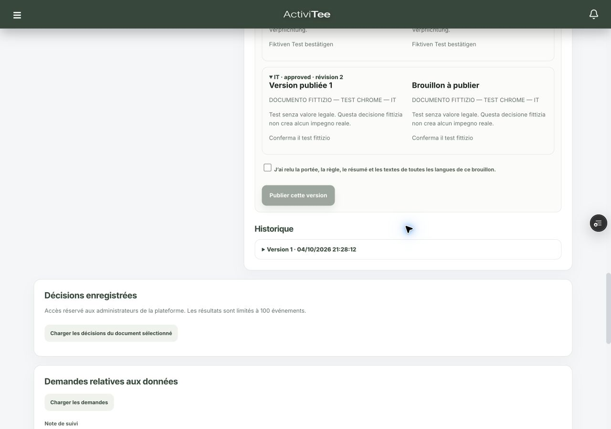

# Rapport unique — campagne de validation des documents juridiques

Date : 4 octobre 2026, deux phases sur TEST. Dépôt : `/Users/activitee/Projects/nextee`, branche `test`.

## Conclusion actuelle

**Le correctif SQL déployé fonctionne sur les scénarios retestés. Le module reste inactif et ne doit pas encore être activé.** Les blocages de publication, les cinq RPC internes exposés, la lecture Marketplace interclub et le conflit d’édition d’événement de la première phase sont résolus sur TEST. La publication et les décisions ont maintenant été exercées dans Chrome avec des textes et utilisateurs fictifs, puis relues en base.

- Déploiement TEST vérifié : **`5a53f7c21561e984ab77c45746ea7ea4f7f63750`**, Vercel **Ready**. Postflight après application : **16 lignes**.
- **29 états Chrome** enregistrés, desktop 1280 × 900 et mobile 393 × 852, sur Admin, Player, Parent, Coach, Manager et un Player d’un second club. Aucun débordement horizontal dans ces états.
- **29 contrôles d’intégrité + 7 contrôles finaux réussis** sur les fixtures persistées ; **16 contrôles métier/accès**, édition d’événement avec conflit **PT409**, **94 refus de lecture PostgREST** réussis.
- **58 tests locaux réussis**, TypeScript et ESLint ciblé sans erreur. Deux corrections de saisie Admin et une clarification d’état parental sont **locales, non déployées**.
- Nettoyage vérifié : **garde SQL false, aucun document actif, six comptes fictifs bannis**, appartenances désactivées, rôle Admin fictif retiré et objets privés supprimés. Quatre versions et dix décisions entièrement fictives sont conservées par les protections d’immutabilité.

Aucune donnée personnelle réelle modifiée, aucun vrai courriel, aucun accord réel, aucune activation et aucune opération sur la production. Ces résultats ne constituent aucune attestation de conformité juridique ou Store.

## 1. Environnement et méthode

| Élément | Preuve observée |
|---|---|
| Supabase | `golf-juniors-app`, branche **test / PREVIEW**, référence **`wizbeuuvjibmmuxyynly`** ; correspondance avec la configuration locale |
| Application | `https://test.activitee.golf` |
| Vercel | Déploiement `CHY4v1K3XWvPuD6xoZ3eYyEuMedh`, commit `5a53f7c`, branche `test`, état **Ready** |
| Origine Chrome des fixtures | `https://nextee-35d1mrohi-fabrice-joliats-projects.vercel.app`, ce même déploiement ; session fictive distincte de celle de l’utilisateur sur le domaine TEST |
| Variables Vercel | Recherche `LEGAL_`, toutes les catégories d’environnement : **No Results Found** ; aucune variable modifiée ni secret affiché |
| Garde SQL | `legal_enforcement_control.enabled=false`, contrôlé avant, pendant et après les essais |

Les migrations `20261020` à `20261102` **n’ont pas été rejouées** pendant cette reprise. Le postflight 25 a été exécuté en lecture seule dans le projet TEST authentifié. Il confirme notamment les quatre résolutions `extensions.digest`, les cinq helpers fermés aux clients, les cinq conflits applicatifs `PT409` et la politique restrictive Marketplace.

Les requêtes automatisées vers le domaine TEST ont rencontré la protection Vercel (401 avant l’application). La revue automatique a rejeté le recours au mécanisme d’accès de `vercel curl` sans autorisation spécifique. Une question a été adressée à l’utilisateur ; aucune réponse n’était reçue à la clôture. **Aucun bypass n’a été exécuté, aucune protection désactivée.** Les parcours applicatifs ont donc été testés dans Chrome authentifié, et les vérifications de persistance/RPC via le client Supabase TEST autorisé. Les résultats RPC ne sont pas présentés comme des tests HTTP applicatifs.

Preuves : [environnement](evidence/20261004-deployed-environment.json), [postflight, 16 lignes](evidence/20261004-deployed-postflight.json), [états Chrome](evidence/20261004-deployed-browser-results.json).

## 2. Matrice consolidée des scénarios

**CHROME TEST** : interaction dans le déploiement ci-dessus, avec relecture des écritures en base. **RPC TEST** : appel direct du noyau serveur avec fixtures ; ne couvre pas la route HTTP. **LOCAL → TEST** : application locale branchée sur Supabase TEST lors de la première phase. **SQL ANNULÉ** : transaction de preuve de la première phase, intégralement annulée.

| Scénario | Résultat actuel | Preuve et limite |
|---|---|---|
| Création de brouillon, FR/EN/DE/IT, sauvegarde et approbation, résumé, revue de règle, comparaison, publication | **RÉUSSI CHROME TEST** | Document `_ui`, quatre textes explicitement sans valeur juridique, V1 publiée par Admin fictif ; `deployed-ui-draft`, `deployed-ui-publication` |
| Proposition de traduction automatique | **RÉUSSI LOCAL → TEST**, pas retesté sur Vercel | Première phase `extra-results` ; proposition distincte de l’approbation ; qualité juridique non évaluée |
| Parent/optional : préparation des deux autres documents | **RÉUSSI RPC TEST** | `deployed-fixture-publications` ; provisioning de fixtures, pas preuve de leur création UI |
| Décision personnelle Player FR, Parent EN, Coach DE, Manager IT | **RÉUSSI CHROME TEST + persistance** | Acteur, bénéficiaire, version, langue, texte et empreinte conservés ; `deployed-integrity-results`, `deployed-persisted-decisions` |
| Admin : gestion et revue des documents | **RÉUSSI CHROME TEST** | Éditeur sélectionné, quatre langues, publication, revue parentale et résolution du retrait ; desktop/mobile |
| Décision personnelle d’Admin sur document plateforme | **NON VÉRIFIÉ** | Aucun document plateforme actif créé : il aurait été applicable à de vrais comptes Admin |
| V1 ouverte, publication V2, tentative de décision sur V1 | **RÉUSSI CHROME TEST** | Message `Legal version changed`, aucune nouvelle décision V1 ; V2 publiée par provisioning RPC, puis réaffichée dans Chrome |
| V2 exige une nouvelle décision ; refus V2 ; conservation V1 | **RÉUSSI CHROME TEST + persistance** | Nouvelle validation requise, refus conservé, décision V1 et texte inchangés ; contrôles finaux |
| Consentement facultatif, retrait, nouvelle autorisation avant résolution | **RÉUSSI CHROME TEST + persistance** | `consented` → `withdrawn`, conflit vrai ; réautorisation refusée |
| Résolution motivée Admin puis nouveau consentement | **RÉUSSI CHROME TEST + persistance** | Résolution distincte enregistrée, conflit levé, retrait toujours dans l’historique |
| Lien familial seul / représentation vérifiée | **RÉUSSI CHROME TEST**, refus noyau en première phase | Aucun bouton enfant avant revue ; revue Admin fictive, état `verified`, bouton enfant ensuite |
| Code parental incorrect puis correct | **RÉUSSI CHROME TEST + persistance** | Mauvais code rejeté avec une tentative ; succès suivant consomme le défi et consigne l’enfant + `parent_email_confirmed=true`. Deux soumissions au total ; aucun mail envoyé |
| Code consommé, cinq erreurs, expiration, limite de fréquence, représentant révoqué | **RÉUSSI RPC TEST** | Rejets explicites ; dernier défi fictif expiré pour le test ; assertion fictive révoquée |
| Reprise identique des quatre décisions et décision parentale | **RÉUSSI RPC TEST** | Même identifiant retourné ; décision différente avec même clé refusée |
| Deux appels réellement simultanés, même clé | **RÉUSSI RPC TEST** | Deux réponses identiques, une seule ligne de décision ; contrôle final |
| Club B ne voit pas le document A | **RÉUSSI CHROME TEST + RPC TEST** | Liste vide desktop/mobile ; présentation étrangère refusée |
| Faux rôle / langue `es` | **RÉUSSI RPC TEST** | Présentation refusée |
| Ancien client sans aperçu / aperçu périmé de publication | **RÉUSSI RPC TEST** | Rejet du snapshot absent ou ancien ; ancien client d’approbation aussi couvert par tests locaux |
| Langue manquante, traduction non relue, variable inconnue | **RÉUSSI RPC TEST** | Publication refusée ; brouillon fictif restauré après chaque série |
| Immutabilité présentation / décision / version | **RÉUSSI RPC TEST** | Suppression/modification refusée, y compris par le service de test |
| Accès Admin HTTP refusés aux autres rôles | **RÉUSSI LOCAL → TEST**, pas rejoué automatiquement sur Vercel | Six 403 en première phase ; protection Vercel bloquante pour ce lot automatisé |
| Tables privées | **RÉUSSI TEST** | 47 relations × anon/Player : 94 requêtes `limit=0`, toutes refusées ; aucune lecture de données personnelles |
| Cinq helpers internes | **RÉUSSI TEST après correctif** | Refus `42501` aux clients ; usages internes légitimes préservés dans les flux métier testés |
| Groupes, création d’événement et réessai | **RÉUSSI TEST, périmètre ciblé** | Groupe/événement persistés, même événement au réessai, fil créé indirectement, lecture étrangère vide |
| Édition occurrence Manager → corps métier Coach | **RÉUSSI TEST après correctif** | Édition normale persistée ; snapshot périmé renvoie rapidement `PT409 / planning_conflict`, sans ancien timeout |
| Messagerie | **RÉUSSI TEST, périmètre ciblé** | Message entre fixtures persisté ; accès étranger refusé |
| Golf / OM | **RÉUSSI TEST, périmètre ciblé** | Partie/trou/agrégat, édition parentale ; autre club refusé ; visibilité OM selon rôle/club |
| Marketplace | **RÉUSSI TEST après correctif** | Lecture propre club admise, anon et autre club filtrés |
| Storage privé | **RÉUSSI TEST, périmètre ciblé** | Dépôt client direct refusé, accès privé autorisé selon rôle, autre club refusé ; préparation/finalisation applicative déjà testée LOCAL → TEST, pas rejouée sur Vercel |
| Demande relative aux données | **RÉUSSI LOCAL → TEST**, circuit limité | Demande fictive persistée et clôturée ; aucune exécution réelle d’un droit |
| Gardes actifs / arrêt effectif des traitements après refus ou retrait | **NON VÉRIFIÉ, hors autorisation** | Aucun garde activé ; les effets métier sous activation ne sont pas déduits des tests de registre |

Preuves récentes : [29 contrôles d’intégrité](evidence/20261004-deployed-integrity-results.json), [7 contrôles finaux](evidence/20261004-deployed-final-checks.json), [décisions persistées](evidence/20261004-deployed-persisted-decisions.json), [16 contrôles métier](evidence/20261004-deployed-business-results.json), [édition PT409](evidence/20261004-deployed-event-edit.json), [94 refus directs](evidence/20261004-deployed-direct-read-results.json), [compteur après mauvais code](evidence/20261004-deployed-wrong-parent-code.json).

Un premier contrôle du compteur parental attendait à tort une seule tentative après le succès : l’implémentation compte toutes les soumissions, y compris la bonne. L’assertion a été corrigée à deux, après vérification de la tentative incorrecte seule (une) et du code SQL. Ce faux échec du script n’est pas une anomalie produit masquée.

## 3. Contrôle visuel et corrections locales restantes

L’éditeur Admin a été utilisé avec le document fictif sélectionné, sur les quatre langues ; la publication, l’historique, la représentation parentale et les retraits ont été manipulés. Les écrans de présentation/décision Player, Parent, Coach et Manager ont été observés dans les deux tailles. L’historique Player non vide a été déplié sur mobile. Les 29 états sauvegardés n’ont pas de débordement horizontal. Cela ne constitue pas une validation native iOS ou une validation d’accessibilité complète.



[Éditeur mobile](evidence/deployed-admin-editor-mobile.png) · [Présentation Player mobile](evidence/deployed-player-presentation-mobile.png) · [Historique Player mobile](evidence/deployed-player-history-mobile.png) · [Parcours Parent mobile](evidence/deployed-parent-authorized-mobile.png).

Trois ajustements ont été faits dans le dépôt **après** le commit déployé :

| Défaut ou ambiguïté observé | Correction locale | Vérification |
|---|---|---|
| Saisie du résumé pendant une sauvegarde/relecture, puis perte de cette saisie et erreur `Summary required` | Champs et changements de sélection/langue désactivés pendant l’opération | Test de régression avec réponse différée ; échec avant, succès après |
| Changer de langue efface un résumé non sauvegardé | Séparer l’initialisation du texte traduit et des propriétés communes du brouillon | Test de régression ; échec avant, succès après |
| Carte d’autorisation parentale affichant encore « validation requise » après une décision pour l’enfant | Ne plus présenter l’état personnel du parent comme celui de l’enfant ; renvoi à l’historique par enfant, état personnel libellé « pour moi » | Cause confirmée dans la réponse/lecture du code : la projection listée vise le parent ; TypeScript/lint. Pas de retest Chrome de ce changement local |

La charte et les styles Admin sont conservés. La protection ajoutée ne promet pas de conserver toutes les modifications non enregistrées lors de toute navigation ou de toute autre sauvegarde.

## 4. Audit des accès directs et indirects


Le [registre de revue](evidence/20261004-access-review.csv) comporte **367 entrées** : 223 fonctions, 138 relations et six buckets. Chaque entrée conserve finalité, rôles/grants, colonnes ou paramètres de portée, qualification, appels indirects repérés et limite de preuve. L’[export SQL](evidence/20261004-test-inventory.json) contient les corps complets, politiques, contraintes et triggers, plus une ligne d’environnement.

La classification du registre sert au triage. Une signature, un grant ou l’absence du mot `legal_required_` n’est pas une faille confirmée. Les conclusions confirmées reposent sur les fixtures et sur les chaînes d’appel inspectées ; les autres restent des points de revue.

| Surface | Qualification actuelle | Travail restant |
|---|---|---|
| 91 fonctions réservées au service/interne | Accès client direct fermé par privilèges | Autorisations des routes et des fonctions privilégiées appelantes à maintenir |
| 39 fonctions avec garde ou prédicats du garde | Garde présent, inactif | Tester son effet métier après une future autorisation d’activation sur environnement jetable |
| 39 fonctions de trigger | Pas de mutation RPC autonome du seul fait d’EXECUTE | Inspecter le droit sur l’écriture déclenchante ; ne pas couper les dépendances internes |
| 41 prédicats d’autorisation booléens | Pas de contournement métier démontré | Certains prennent un UUID arbitraire : revoir finalité, exposition anonyme et divulgation d’appartenance/rôle |
| 7 fonctions de calcul/contexte JWT | Pas de mutation métier persistée | Exemption justifiable, à formaliser |
| 5 helpers internes exposés | Appels non autorisés confirmés | Corrigé sur TEST : refus clients et appels métier indirects vérifiés dans la reprise ; conserver les exemptions internes documentées |
| `staff_seed_group_players_attendees` | Mutation avec contrôles de rôle existants ; absence de frontière juridique propre | Revoir garde de l’événement et activité des membres/coach ; aucune preuve de contournement d’un garde actif n’est revendiquée |
| 47 relations privées | Privilèges fermés et 94 refus HTTP vérifiés | Les traitements serveur restent une surface distincte |
| 11 relations avec RLS sans politique permissive | Lignes directes fermées structurellement | Ne pas interpréter le grant SELECT seul comme accès effectif |
| 12 relations d’identité/initialisation | Profil, clubs, rôles, familles, préférences et contexte nécessaires avant accord | Définir des exemptions minimales ; éviter de bloquer connexion, choix d’enfant et consultation juridique |
| `app_translations` | Catalogue public en lecture, finalité distincte | Conserver sa lecture publique ; toute écriture cliente doit rester interdite |
| 8 relations avec garde restrictif, plus Marketplace | Couche installée, inactive | Formaliser la portée juridique propre à chaque club/bénéficiaire ; frontière Marketplace appliquée et retestée sur TEST |
| 58 autres relations métier avec RLS | Couverture juridique non démontrée | Revue des politiques et des parents appelés ; **ce nombre ne signifie pas 58 failles** |
| 5 buckets publics | URLs publiques intentionnellement servies hors garde d’acceptation | Décider les contenus admissibles, révocation, suppression et caches |
| `player-documents` privé | Parcours signé et refus directs contrôlés | Retrait d’accès après émission d’une URL, expiration, caches et traitements différés à compléter |

### Chaînes et limites significatives

- `create_manager_events_v1` déclenche la création/synchronisation du fil ; la révocation des cinq helpers préserve le propriétaire privilégié des triggers. La mise à jour de l’événement et le recalcul du trou réussissent sur TEST après application du correctif.
- `create_manager_activity_batch_v1` consulte le garde plateforme, puis la création repasse par le groupe et son garde, y compris lorsqu’un groupe technique est créé. L’absence de garde club en première ligne n’est donc pas une preuve de contournement. Le chemin de réessai retournant un résultat antérieur mérite une revue du besoin de validation club.
- Les politiques de certaines tables enfants passent par une table parente déjà filtrée ; d’autres utilisent des helpers `SECURITY DEFINER` qui peuvent contourner la RLS parente. Les dépendances de la colonne `indirect_calls` doivent être suivies avant une extension de politique.
- Golf : plusieurs entrées et politiques ne demandent que les validations plateforme, tandis qu’un appel de trou peut déterminer un club via l’organisation OM. La portée attendue doit être définie puis harmonisée ; elle n’est pas réputée complète.
- Le garde HTTP protège les familles de pages Player/Coach/Manager et des API correspondantes, Parent et messages. L’Admin n’a pas de garde personnel obligatoire équivalent. Les autres familles API et exceptions profil/connexion nécessitent une décision explicite et une revue.
- Les contrôles requis actuels portent surtout sur les documents personnels. Une autorisation parentale pour un bénéficiaire et le retrait d’un consentement facultatif n’entraînent pas encore une suspension démontrée de chaque traitement métier concerné.
- Les médias publics, liens déjà émis, tâches différées et caches ne sont pas protégés par la seule redirection vers `/legal/my`.

## 5. Ce qui reste non vérifié avant activation

- **Activation et effets métier** : fermeture de tous les accès requis, exemptions d’initialisation/support/Admin, arrêt des traitements liés à un retrait, périmètre plateforme/club/enfant. La campagne interdit l’activation ; les résultats du registre ne prouvent pas ces effets.
- **Couverture métier complète** : grilles golf 9/18 trous, Miss cut, toutes les surcharges OM ; éditions de séries, présences/évaluations existantes, archivages, camps, compétitions, quiz, publication Étiquette et toutes les mutations du lot 20261101. Les tests métier ciblés réussis ne couvrent pas chaque variante ni tous leurs écrans Chrome.
- **Clients et concurrence** : ancienne application/PWA réellement installée, cache hors ligne, changement de rôle/club/enfant ; concurrence publication/décision et traduction FR/IA. Le double appel de décision identique a été testé, pas toutes les interleavings.
- **Cas parentaux supplémentaires** : deux représentants en désaccord, changement d’e-mail, code lié à un autre enfant ; profils sans nom et variable `child_name` pour un adulte. Les comptes fictifs n’ont pas servi à prétendre valider une véritable autorité légale.
- **Ergonomie complète** : navigation clavier, lecteur d’écran, safe area/native iOS, noms lisibles à la place des UUID abrégés, traduction des libellés d’interface (les documents eux-mêmes ont quatre langues), historique enfant après changement de focus. Le correctif parental local et les deux corrections Admin doivent être revus après déploiement.
- **API Vercel hors navigateur** : lot automatisé applicatif bloqué par la protection d’accès ; aucun bypass exécuté. La preuve Chrome des mutations citées reste valable et distincte.
- **Mail** : transport/délivrabilité réels non testés volontairement. Le défi parental a été provisionné via Supabase, puis sa saisie/validation a été testée dans Chrome.
- **Rétention et droits** : restauration des preuves, purge à échéance, suppression de compte, sauvegardes, journaux, exports et traitements différés. Aucun effacement d’une preuve immuable n’a été tenté en contournant ses protections.

Ces limites sont explicites ; aucune n’est comptée comme réussite de bout en bout.

## 6. SQL, fichiers et tests

### SQL

Le lot unique [`20261102_legal_campaign_repairs.sql`](../../supabase/migrations/20261102_legal_campaign_repairs.sql) a été appliqué par l’utilisateur et son résultat vérifié par le [postflight 25](25-campaign-fix-postflight.sql). **Ne pas le rejouer. Aucun nouveau lot SQL à appliquer n’est proposé par cette reprise.** Les migrations déjà appliquées restent intactes.

Le [préflight 24](24-campaign-fix-preflight.sql) et la [transaction 26](26-campaign-candidate-rollback.sql) documentent la phase antérieure. Le fichier 26 contient un candidat et d’anciennes fixtures : **ne pas le réexécuter sur l’état actuel**.

### Fichiers modifiés dans cette reprise

Le checkout était propre au départ, HEAD `5a53f7c`. Les corrections de la première phase avaient été committées et déployées par l’utilisateur.

- `components/legal/LegalAdminWorkspace.tsx` : protection pendant les sauvegardes et préservation du résumé au changement de langue.
- `app/legal/my/page.tsx` : distinction de l’état personnel et de la décision pour l’enfant.
- `tests/legal-admin-workspace.test.ts` : deux régressions de saisie Admin.
- `scripts/legal-campaign/context.mjs` : phase de reprise, chemins de preuves/manifeste isolés et origines autorisées.
- `business.mjs`, `event-edit.mjs`, `direct-read-checks.mjs`, `http-extra.mjs` : preuves distinctes de reprise, cinquième helper testé, restauration du score fictif après son test.
- `fixture-documents.mjs`, `deployed-integrity.mjs`, `deployed-final-checks.mjs` : provisionnement et tests explicitement distingués des routes HTTP.
- `cleanup.mjs` : contrôle de propriété des documents, désactivation et conservation des preuves fictives immuables.
- Ce rapport, les pointeurs README/readiness/matrice et les preuves `evidence/20261004-deployed-*` / captures `deployed-*`.

Aucun commit, push ou déploiement effectué par l’agent dans cette reprise. Les deux fichiers applicatifs modifiés restent à déployer sur TEST.

### Contrôles locaux exécutés

```sh
node --experimental-strip-types --test tests/legal-*.test.ts tests/player-transactions.test.ts tests/coach-permissions.test.ts tests/manager-event-editor.test.ts tests/manager-groups.test.ts tests/golf-round-metrics.test.ts tests/manager-parents.test.ts tests/manager-camp-conflict.test.ts
npx tsc --noEmit --incremental false
npx eslint components/legal/LegalAdminWorkspace.tsx app/legal/my/page.tsx tests/legal-admin-workspace.test.ts scripts/legal-campaign/*.mjs
```

Résultat : **58/58 tests, TypeScript 0, ESLint 0**. [Journal des tests](evidence/20261004-deployed-local-tests.txt), [relevé des contrôles](evidence/20261004-deployed-local-checks.json). Pas de nouveau build de production : les changements locaux sont contrôlés par ces vérifications ciblées et ne sont pas présentés comme déployés.

## 7. Nettoyage final

Run `legalqa_20261004_9a282f` : clubs `efa61978-72ac-47f0-b0e4-0b692191c2bb` (A) et `e4e6fffc-7d98-4a32-a5aa-22b2e18f2c4a` (B), six comptes `example.invalid`, trois documents marqués sans valeur juridique. Les trois documents ont été activés uniquement pour les fixtures du club A pendant les essais, puis désactivés.

Les six comptes sont bannis, les appartenances inactives, le rôle Admin retiré, la représentation révoquée et le lien familial désactivé. Événement annulé, groupe/organisations inactifs, Marketplace inactive, objet privé supprimé. La session Chrome fictive a été déconnectée ; le viewport normal a été restauré ; la session réelle du domaine TEST n’a pas été utilisée pour les décisions. Les mots de passe/JWT temporaires ont été effacés du manifeste privé.

**État final relu :** `enabled=false`, **0 document actif**, 0 appartenance fictive active, 0 Admin fictif, 0 annonce fictive active, 0 ligne/objet privé restant ; **4 versions et 10 décisions fictives conservées**. Ces preuves sont identifiables par leurs documents et comptes jetables. Les protections d’immutabilité n’ont pas été désactivées pour les purger.

[Preuve du nettoyage](evidence/20261004-deployed-cleanup.json).

## 8. Décisions humaines et prochaine étape

1. Déployer les deux ajustements d’interface locaux sur TEST puis revoir la saisie Admin et le libellé parental. Aucun SQL supplémentaire n’est nécessaire pour eux.
2. Faire approuver les textes/traductions et règles par rôle, âge, territoire, club et représentant ; distinguer contrat, notice et consentement facultatif.
3. Définir les effets du refus/retrait, les conflits entre représentants et les traitements qui doivent cesser ; achever leur couverture d’accès direct/indirect et leurs scénarios métier.
4. Arrêter conservation, purge, sauvegardes, preuves et demandes de droits, y compris le traitement ultérieur des traces fictives.
5. Autoriser séparément une future campagne d’activation isolée une fois ces choix implémentés ; garder les deux gardes désactivés jusque-là.
6. Traiter séparément App Store/Google Play et production. **Les résultats ci-dessus concernent TEST exclusivement.**

## 9. Historique de la première phase, conservé pour traçabilité

Avant l’application utilisateur du lot, le run `legalqa_20261004_673faa` avait produit 56 tests locaux réussis, 42 assertions SQL dans une transaction annulée, 94 refus de lecture privée et 20 états Chrome sans version active. Les échecs persistés étaient la résolution `digest`, l’exposition de cinq helpers, la lecture Marketplace étrangère/anonyme et le timeout d’un conflit d’événement. **Ces échecs décrivent l’ancien état de TEST ; ils sont résolus dans les scénarios de reprise ci-dessus.**

Les corrections déjà déployées incluent aussi la sérialisation JSON PostgREST des traductions, la comparaison du texte réellement relu, le filtrage d’applicabilité avant validation et la compatibilité des conflits `PT409`/`40001`.

Preuves historiques : [HTTP](evidence/20261004-http-results.json), [métier](evidence/20261004-business-results.json), [compléments](evidence/20261004-extra-results.json), [timeout événement](evidence/20261004-event-edit.json), [42 contrôles SQL annulés](evidence/20261004-candidate-rollback-results.json), [20 états Chrome](evidence/20261004-browser-results.json), [nettoyage initial](evidence/20261004-cleanup.json). La première clôture avait zéro version/décision ; la clôture actuelle en conserve quatre/dix, entièrement fictives.
